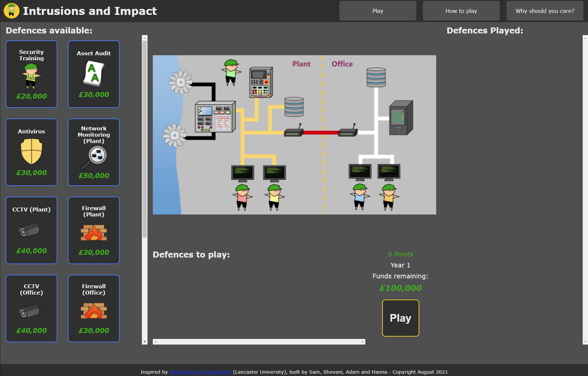
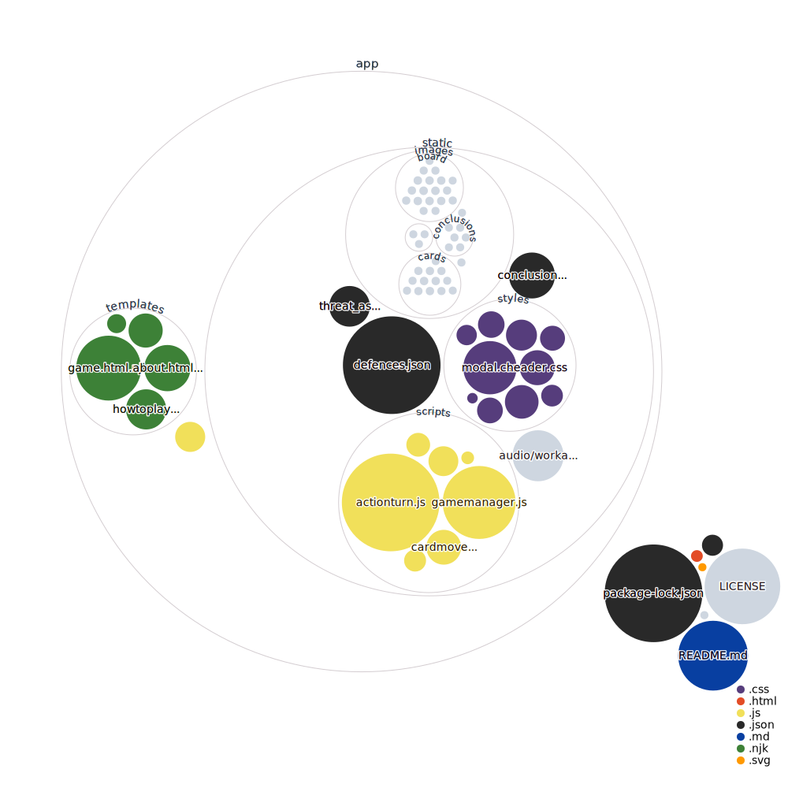

# Intrusions and Impact
A Cyber Security discussion game based on Decisions and Disruptions

This is a web-port of the card/tabletop/lego game [Decisions and Disruptions](https://www.decisions-disruptions.org/), originally designed by Lancaster University. It was built by four placement students in 4 weeks during our 2021 summer placement with [Atkins](http://www.atkinsglobal.com/cyber).

## Running the game server
1. Clone or download
   * `git clone https://github.com/atkinscyberacademy/Intrusions-Impact.git`
   * `git clone git@github.com:atkinscyberacademy/Intrusions-Impact.git`
   * Click https://github.com/atkinscyberacademy/Intrusions-Impact/archive/refs/heads/main.zip
1. Install Node.js from the [Node.js website](https://nodejs.org/en/)
1. Open command line in the project root directory (e.g. cd Intrusions-Impact)
1. Run `npm install` to install required dependancies
1. Run `node index.js` to start the server
1. Navigate to [localhost:3000](localhost:3000)

## Adapting the game to suit your needs
### Application structure
This is a pretty standard Node.js project, with a file structure inspired by Flask.
- `index.js` initialises the application and should be used as the entry point.
- `/app/app.js` is the only server-side script, using Express and Nunjucks to serve files to clients.
- `/app/templates/` contains all the Nunjucks templates (and hence HTML) for the application. Template inheritence is used, with all templates inheriting from the `/app/templates/base.html.njk` file.
- `/app/static/` contains all front-facing files. **Anything placed in this folder WILL be publicly accessible when the application is launched**. This folder is mapped to the web root by Express when the server is initialised.
  - `/app/static/defences.json` is the master datafile for defining defences and their associated consequences. See the section on editing defences.json for more.
  - `/app/static/conclusions.json` contains conclusion data for the final endgame conclusion.
  - `/app/static/threat_assessment.json` contains data for computing advice to be given when the Threat Assessment card is played.
  - `/app/static/audio/` contains audio assets (only one file - `workaudio.mp3` - which is played whilst defence installation animations are being played).
  - `/app/static/images/` contains all image assets for the project.
  - `/app/static/scripts/` contains all scripts for the project (game logic and visuals).
  - `/app/static/styles/` contains all CSS for the project.

I've endeavoured to comment my code clearly and exhaustively, normally down to codeblock-level. I haven't used JSDoc annotations (@param etc) but the code structure should be clear enough.

### Editing defences.json
Defences.json is the master data file for all defences and consequences. It is a JSON object associating an integer ID with a defence object. Each defence object contains the following keys:

- `id` - Integer ID of defence. Should align with the defence's key in defences.json.
- `name` - Display name of the defence.
- `location` - Either 'plant', 'office' or 'both'. Not currently used.
- `image` - Name of image to be displayed on card. Path not neccessary as the code knows to look in `/app/static/images/cards/`.
- `graphic` - Name of relevant overlay to render on gameboard. Path not neccessary as the code knows to look in `/app/static/images/board/`.
- `cost` - Integer cost of the card.
- `shortdesc` - Short description, displayed large at the top of info card.
- `longdesc` - Longer description, displayed small at the bottom of info card.
- `outlink` - Link to more information on the defence. Displayed at the bottom of info card.
- `prerequisite` - ID of defence which needs to be played before this defence can be, or -1 if this defence can be played freely at any time. Used to make the Asset Audit defence work.
- `onplay-scoredelta` - List of 4 values (>= number of turns in the game), defining the change in score when the card is played. Played on turn 2 means that `onplay-scoredelta[2]` is added to the score etc.
- `neverplayed-scoredelta` - Score used to ensure important defences are included in the final conclusion 'improvements' page if they're not played. -2 means not playing the defence ends the game early, -1 means not playing the card leads to a bad ending, 0 or greater means it's a very low priority card.
- `onplay-text` - Text to be displayed as a consequence on the turn the card is played. Currently used for Threat Assessment and Asset Audit defences.
- `consequences` - List of 4 (>= number of turns in the game) objects, each containing an `installed` key and a `notinstalled` key. Each turn, the application iterates over every defence, finds the item in the consequence object at the index equal to the current turn, and adds the relevant consequence to the list of consequences to display. Each `consequence` object is structured the same, whether under `installed` or `notinstalled`. This structure is:
  - `text` - Text to be displayed when this consequence is triggered. If this is blank, the consequence is considered to be blank. This is okay (if not reccomeded a lot of the time) as too many consequences each turn can overload players.
  - `scoredelta` - Integer score change to be applied if this consequence is triggered. If this is +VE, it's considered 'good' and green is used for display. If 0 or -VE, it's considered 'bad' and red is used. 
  - `type` - Source of the attack. Used for the 'xyz Attack!' or 'xyz Blocked!' stinger.
  - `image` Name of relevant image to display under the consequence. Path not neccessary as the code knows to look in `/app/static/images/consequences/`. If left blank, no image is displayed.
  - `stat` - Short statistic relevant to the consequence.
  - `stat-source` - Link to the source website for the stat.
  - `example` - Short real-world example of a similar consequence.
  - `example-source` - Link to a more in-depth article/case study of the example.
  - `improvement` - Improvement to be displayed on the final conclusion page if this consequence is reached. Can be left blank.
  - `causes-end` - Boolean - should this consequence being reached trigger the endgame immediately?

### Game logic
Game logic is contained mostly in `/app/static/scripts/gamemanager.js` and `/app/static/scripts/actionturn.js`, with other scripts handling specific elements (eg. modals) or providing helper functions.

Not much should need to change in the game logic if adapting the game to your environment, the only element of the game which is hardcoded in is the 'Threat Assessment' card, which is in lines 69-75 of file `/app/static/scripts/actionturn.js` and the entirety of the `/app/static/threat_assessment.json` file.

### Cards and Consequences
If score values are changed, it may be wise to revisit the endgame score thresholding values (`/app/static/scripts/gamemanager.js`, lines 71-87).

### Graphical elements
The graphics work using PNG transparency. All defences are visualised as 'overlays', files of the same dimension as the baseplate image with areas of transparency surrounding the upgraded component. All assets sit on top of the gameboard baseplate image using absolute positioning, and are defined at page request when Nunjucks preprocesses the page. When a defence is played, it's associated overlay if located and has its opacity faded from 0 to 1 over two seconds. Whilst this occurs, the 'cyber steve' overlay `/app/static/images/board/hammersteve/.png` (again, transparent background) is animated using CSS keyframes in `/app/static/styles/playspace.css`.

### Code Map

